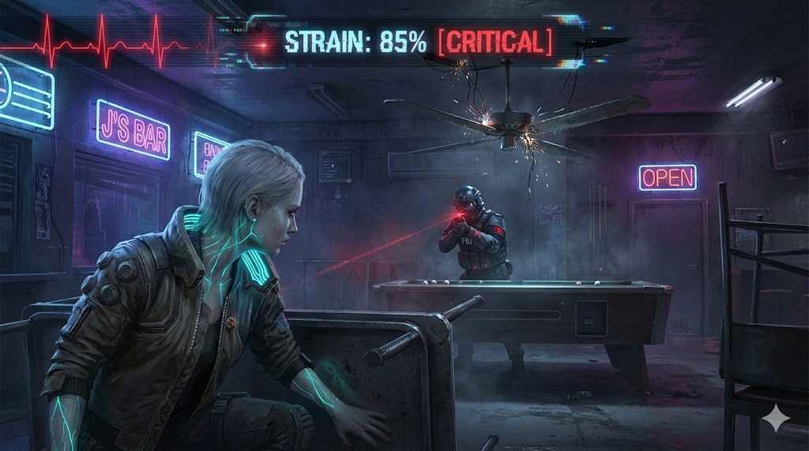

# Game Design Document: STRAIN

> *Concept Art: The tutorial stage at "J's Bar". Rin hides from an FBI Negotiator while managing critical Strain levels.*

> **License & Usage**
> This document is released under the **[CC BY 4.0 Attribution]** license.
> You are free to use these concepts to develop a game, practice game engine skills, or create prototypes.
> **Requirement**: If you release a project based on this GDD, please credit "Original Concept: Poleaxe". I am also available as a consultant for lore and mechanics if needed.

---

## I. Overview

* **Title**: STRAIN
* **Genre**: Survival Action / Reverse Horror / Stealth Puzzle
* **Tagline**: "We are not monsters. We are merely the infected witnesses."
* **Implementation Options**:
    *While the core "Strain System" is genre-agnostic, the following formats are highly recommended:*
    * **2D Tactical / Top-Down**: ideal for visualizing "Line of Sight" and coordinating team-based rescues (similar to *Hotline Miami* or *Darkwood*).
    * **Third-Person Shooter (TPS)**: Enhances the visceral connection to the character's mutation and the visual stress of the "Strain Gauge" (similar to *Control* or *Dead Space*).
    * **Action RPG**: Focuses on the management of "Strain" as a resource cost for abilities and character progression.
* **Unique Selling Points (USP)**:
    1.  **Reverse Horror**: You play as the "monster" with devastating powers, hunted by elite human special forces.
    2.  **The Pacifist’s Burden**: You possess the power to destroy the world, but to prove your humanity, you **must not kill**.
    3.  **Double Death**: You must survive without being killed, without losing control (Viral Overload), and without losing your soul (killing humans).

---

## II. Setting & Premise

### 1. The World
* **Location**: The Quarantine Zone of "New Eden City" (Near Future).
* **Incident**: A covert government bioweapon experiment leaked the **"Strain-ZV"** gas.
* **Cover-up**: The government declared it a terrorist chemical attack and deployed "The Cleaners"—a black-ops unit with one mission: **Destroy all evidence**, including the survivors.

### 2. The Protagonists
* Players control a group of survivors who inhaled the gas.
* Instead of turning into mindless zombies, they mutated, gaining superhuman abilities.
* **The Conflict**:
    * **Internal**: The virus is multiplying. Without "Antivirals," you will eventually turn into a mindless abomination.
    * **External**: Heavily armed human forces are hunting you down.

### 3. The Goal
1.  Secure the Antiviral to suppress the virus.
2.  Escape the Quarantine Zone before the virus consumes your mind, and expose the truth to the world.

---

## III. Core Mechanic: The STRAIN Gauge

This is your lifeline, replacing the traditional HP bar.
**UI Design**: A dynamic EKG-style monitor stretching across the top of the screen (Refer to Concept Art).

### A. Rules of Strain
* **Passive Accumulation**: Increases slowly over time (viral corruption).
* **Active Cost**: Using abilities (Dash, Shield, Jamming) consumes stamina and significantly increases Strain.
* **Damage Spike**: Taking gunfire doesn't kill you instantly, but the pain accelerates viral replication, spiking your Strain.
* **Reduction**:
    * Injecting rare "Antivirals."
    * (Performing non-lethal takedowns and absorbing bio-electricity from enemy gear.)

### B. Stages of Infection
* **Stage I: Latent (0% - 20%)**: Look human. Abilities locked. Enemy suspicion is low.
* **Stage II: Awakened (20% - 80%)**: Veins glow. Abilities unlocked. Enemies shoot on sight.
* **Stage III: Critical (80% - 99%)**: Visual/Auditory hallucinations (glitch effects). Damage doubled, but accuracy plummets.
* **Stage IV: Overload (100%)**: **GAME OVER**.

### C. Mechanic: Bleeding Out
* **Trigger**: When a human enemy takes "Lethal Damage" (e.g., stray bullets, explosions), they don't die immediately.
* **State**: They enter a **"Critical"** state, downed with a red countdown timer (e.g., 30s) above their head.
    * If timer hits 0 -> Enemy dies -> **GAME OVER (Moral Failure)**.
    * If hit again -> Enemy dies -> **GAME OVER**.

### D. Action: Stabilize
You must rush to the dying enemy and perform emergency care before time runs out.
* **Action**: Hold the interaction key to stabilize.
* **Choice**:
    1.  **Use Medkit**: Consumes a rare resource. Safe.
    2.  **Cauterize (Strain Ability)**: Use your powers (e.g., thermal sealing) to save them.
* **Cost**: Cauterizing **increases Strain by 15%**.
* **The Irony**: To save the man trying to kill you, you must push yourself closer to becoming a monster.

### E. The Strain Algorithm (System Logic)
To transition from concept to code, the Strain Gauge is defined by the following logic rules:

**1. Base Variables**
* `Current_Strain` (Float: 0.00 to 100.00)
* `Panic_Multiplier` (Float: 1.0x to 2.5x based on proximity to enemies)

**2. Passive Growth Formula**
* `Delta_Strain = (Base_Rate * Time) * Panic_Multiplier`
* *Design Note*: Base_Rate should be 0.5% per second. If an enemy is within 5 meters, Panic_Multiplier increases to 1.5x.

**3. Action Costs (Hard Data)**
| Action | Strain Cost | Cooldown | Note |
| :--- | :--- | :--- | :--- |
| **Dash / Jump** | +3.0% | 1.5s | Basic movement cost. |
| **Active Ability** | +12.0% | 8.0s | E.g., Rin's Phase, Arthur's Wall Smash. |
| **Taking Damage** | +Damage_Value * 0.5 | 0s | Pain converts directly to infection. |
| **Cauterize (Save Enemy)** | +15.0% | N/A | **The Moral Tax.** |

**4. Threshold Triggers**
* `IF Current_Strain > 80%`: Apply screen shader (Glitch_Effect); Audio pitch shift +10%; Accuracy -40%.
* `IF Current_Strain >= 100%`: Trigger Function `GameOver_ViralOverload()`.

---

## IV. Game Over Conditions

Failure comes in two forms: Physical collapse or Moral collapse.

### Condition A: Viral Overload
* **Trigger**: STRAIN Gauge hits **100%**.
* **Outcome**: The protagonist loses all sanity, transforms into a monstrosity, and slaughters their team.
* **Screen Text**: "SUBJECT LOST".

### Condition B: Moral Event Horizon
* **Trigger**: **Any human enemy dies** (HP reaches 0).
* **Outcome**: In fighting to prove you aren't a monster, you proved the government right.
* **Sequence**: Time Freeze -> Zoom in on corpse -> Protagonist screams -> STRAIN instantly fills to 100% -> Overload.
* **Screen Text**: "PROVEN GUILTY".

---

## V. Characters & Progression

### A. Arthur - "The Breaker" (Tank / Crowd Control)
* **Role**: Creating cover and physical separation.
* **Ability**: **Gravity Shield** - Deploys a one-way shield.
* **Ability**: **Breach** - Smashes through specific "Weak Walls" (highlighted in UI).

### B. Rin - "The Phantom" (Scout / Medic)
* **Role**: Rapid response and risky rescues.
* **Ability**: **Phase Dash** - Invincible during dash frames.
* **Ability**: **Ghosting** - Can move through thin walls.

### C. Dr. Aris - "The Silencer" (Support / Debuff)
* **Role**: Information warfare and enemy suppression.
* **Ability**: **Neuro Pulse** - AoE Jamming (disables comms and heavy weapons).
* **Ability**: **Combat Medic** - Passive: Stabilize speed +50%.

### D. Mutation Evolution (Progression System)
Players collect "Viral Samples" from hidden caches to evolve abilities.
* **Arthur's Evolution**:
    * *Lvl 1*: **Kinetic Payback** - Shield absorbs damage and releases a shockwave when dropped (Non-lethal knockback).
    * *Lvl 2*: **Bunker** - Shield width increases by 50%.
* **Rin's Evolution**:
    * *Lvl 1*: **Afterimage** - Dash leaves a hologram that distracts enemies for 2s.
    * *Lvl 2*: **Transfusion** - Dashing through an enemy steals 5% Strain from you and gives it to them (Stuns them).
* **Dr. Aris' Evolution**:
    * *Lvl 1*: **Feedback Loop** - Jammed enemies drop "Bio-batteries" that reduce team Strain.
    * *Lvl 2*: **Remote Hack** - Can trigger environmental traps (sprinklers, shutters) from a distance.

### E. Team Synergy (Resonance Actions)
Mechanics that require two characters to interact.
1.  **Phalanx Charge (Arthur + Rin)**: Rin dashes *through* Arthur's shield -> Shield creates a forward moving energy wave -> Knocks back all enemies in a corridor.
2.  **Amped Static (Arthur + Aris)**: Aris uses Neuro Pulse while standing behind Arthur's Shield -> Pulse range doubled.

---

## VI. Antagonists & AI Logic

Enemies are defined by strict behavior states (State Machine) and distinct loadouts.

### A. Unit Stats & Behavior
| Unit Type | Weapon | Dmg (HP) | Dmg (Strain) | Behavior Tag |
| :--- | :--- | :--- | :--- | :--- |
| **Riot Police** | Taser X26 | 5 | **25** | `Coward`: Flees if alone. Flanks if grouped. |
| **PMC Merc** | Carbine | **15** | 10 | `Suppressor`: Holds position, fires continuously to pin player. |
| **The Cleaner** | Flamethrower | 10/sec | **40/sec** | `Hunter`: Always moves toward player. Immune to Stun. |

### B. AI State Machine
For implementation, enemy AI follows this logic flow:
1.  **IDLE**: Static or patrolling fixed nodes. `FOV = 60 degrees, Range = 10m`.
2.  **SUSPICIOUS**: Heard noise/Saw glimpse. Move to investigate location. `FOV = 90 degrees`.
3.  **ALERT**: Confirmed visual. Radios for backup (3s delay). If interrupted, backup call fails.
4.  **ENGAGE**: Line of Sight established.
    * *If Player Strain < 50%*: Use lethal weapons.
    * *If Player Strain > 80%*: "Target Critical!" AI switches to containment tactics (Flashbangs/Nets) to capture.
5.  **CRITICAL (Bleeding Out)**: HP < 0. Drop weapon. Trigger `Death_Timer (30s)`.

---

## VII. Sample Level Design: "J's Bar" (Tutorial Stage)

**Objective**: Escape through the back alley.
**Constraint**: The back door is locked. Keycard is on the "FBI Negotiator".

**Zone Layout & Item Placement**:
1.  **The Front Area (Entry)**:
    * *Enemy*: 2x Riot Police (Patrolling).
    * *Item*: **Stabilizer (Small)** - Located behind the counter. Reduces Strain by 10%.
2.  **The Corridor (Choke Point)**:
    * *Hazard*: Security Camera. If spotted -> Spawns 1x PMC Merc.
    * *Tactic*: Use Dr. Aris to hack the camera OR Rin to phase through the blind spot.
3.  **The VIP Room (Boss Arena)**:
    * *Boss*: **FBI Negotiator**. He takes cover behind the pool table.
    * *Dynamic Event*: A ceiling fan is wobbling above him.
    * *Solution (Non-Lethal)*:
        1.  Wait for him to reload.
        2.  Shoot the fan support -> Fan falls -> Traps him (Pinned).
        3.  Steal Keycard -> Run.
    * *Failure State*: If you shoot him -> He enters "Bleeding Out" -> You must stabilize him within 20s or Game Over.

---

## VIII. The Gameplay Loop

> **"The fight is just the beginning. Redemption is the end."**

1.  **Conflict**: Engage squad. Use powers to knock them out.
2.  **Accident**: A stray bullet hits a gas tank. Explosion injures a Cleaner.
3.  **Crisis**: Cleaner enters "Bleeding Out" state. Alarm blares.
4.  **Dilemma**:
    * Do you rush into crossfire to save him?
    * Or finish the objective (and risk running out of time)?
5.  **Cost**: Rin dashes in, using Strain to cauterize the wound. The enemy lives, but Rin is now at 95% Strain—on the brink of madness.
6.  **Restriction**: **Conscience Lock**—Exit doors will NOT open if there is a dying enemy in the area.

---

## IX. Atmosphere

* **Visual Style**: Cold tones (Blue/Grey/Black) + High Contrast Neon Red (Enemy Lasers/UI).
* **UI**: Minimalist, Medical Monitor aesthetic with digital glitch effects.
* **Audio**:
    * *Ambience*: Low-frequency heartbeat (speeds up with Strain).
    * *Enemy*: Tactical radio chatter, static.

---

## X. Credits & Acknowledgments

* **Original Concept**: Poleaxe
* **Design Consultant**: Gemini (AI)
* **Community Contributors**:
    * *Joshthedruid2* (Reddit) - For genre clarification and tactical feedback.
    * *WittyConsideration57* (Reddit) - For critical feedback on algorithm definition, progression systems, and technical implementation specs.

---

## XI. Technical Specifications (For Prototyping)

### A. Grid & Metrics (If 2D Tactical)
* **Tile Size**: 1 Unit = 1 Meter.
* **Player Movement**: 6 Units/Turn (or 6m/s in Real-time).
* **Cover System**:
    * *Half Cover*: Reduces Hit Chance by 40%.
    * *Full Cover*: Reduces Hit Chance by 80%.

### B. Field of View (FOV) Algorithm
* **Type**: Raycasting (2D) or Frustum Culling (3D).
* **Rules**:
    * Origin: Enemy Head Bone.
    * Occlusion: Static Geometry (Walls) blocks rays. Dynamic Objects (Tables) block rays if `Object_Height > 1.2m`.
    * **Visibility Check**: `IF Raycast(Enemy, Player) == TRUE AND Angle < FOV_Cone THEN Seen = TRUE`.

> **Contact**
> If you are interested in developing this project, feel free to reach out via Email (spellpluspoleaxe@gmail.com). I am happy to provide further consultation on mechanics and lore.
